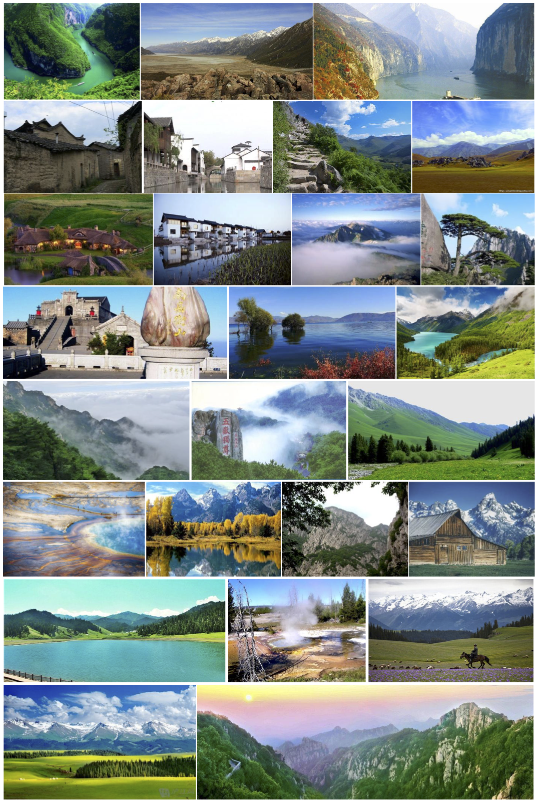
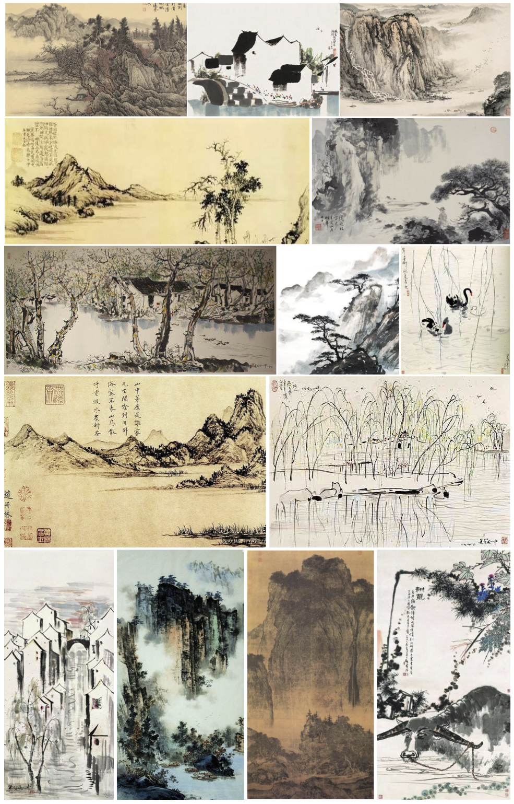

# *Neural abstract style transfer for Chinese traditional painting*
By Bo Li, Caiming Xiong, Tianfu Wu, Yu Zhou, Lun Zhang and Rufeng Chu

## Introduction
This repo provides Chinese Traditional Painting dataset for paper - Neural abstract style transfer for Chinese traditional painting. 
Chinese Traditional Painting dataset contains 1000 content images and 100 style images. 

The content images are mostly the photorealistic scenes of mountain, lake, river, bridge, and buildings in regions south of the Yangtze River. It includes not only the scenes of China, but also beautiful pictures of Rhine, Alps, Yellow Stone, Grand Canyon, etc. These images are only used for testing. Some typical examples are show below.



The style images include diverse types of Chinese traditional paintings. Some typical examples are presented below.



## Citing our work and Chinese Traditional Painting dataset

If you find our work is useful in your research, please consider citing:
```
@inproceedings{ChineseStyle,
    Author = {Bo Li, Caiming Xiong, Tianfu Wu, Yu Zhou, Lun Zhang, Rufeng Chu},
    Title = {Neural abstract style transfer for Chinese traditional painting},
    Conference = {ACCV},
    Year = {2018}
}
```

## Downloading Chinese Traditional Painting dataset
